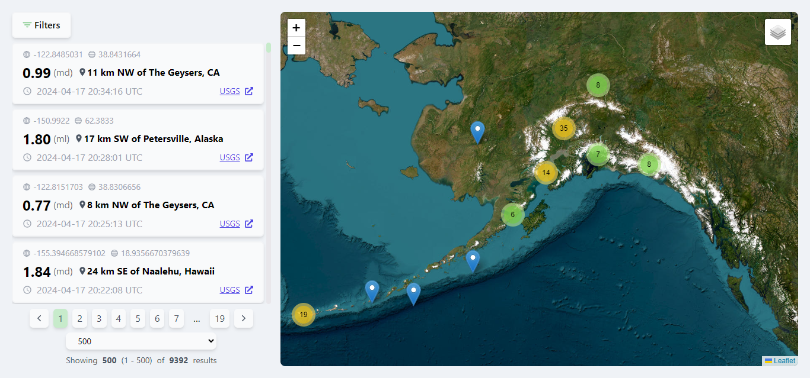
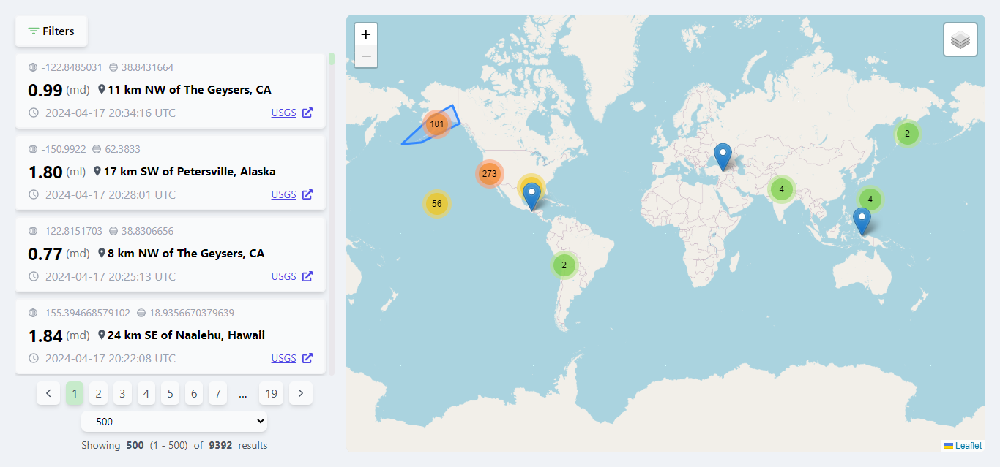
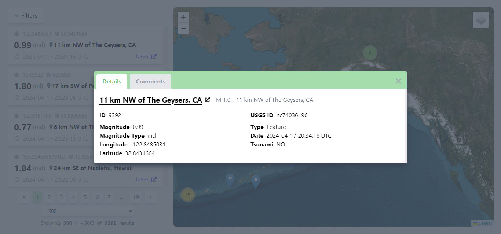
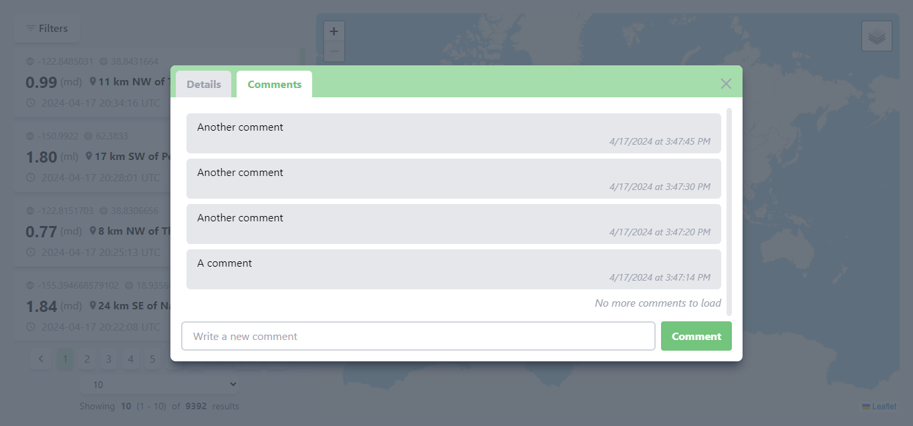
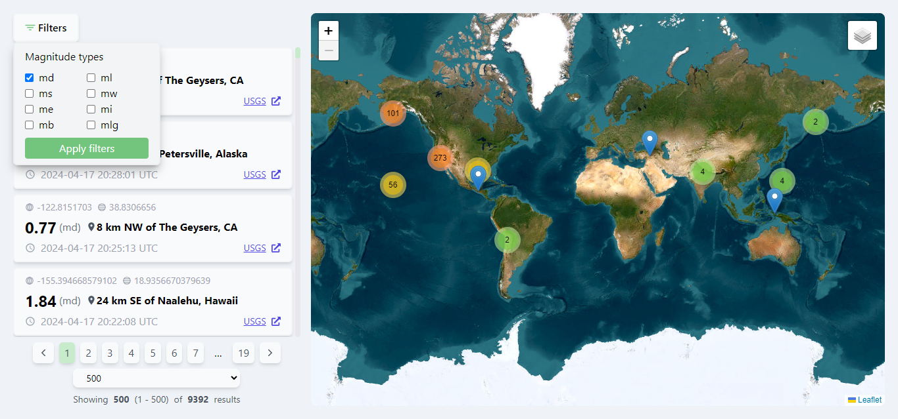
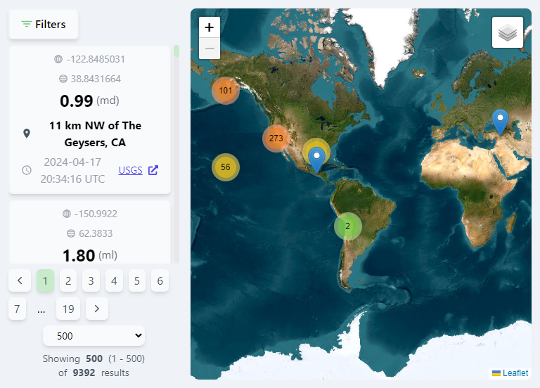
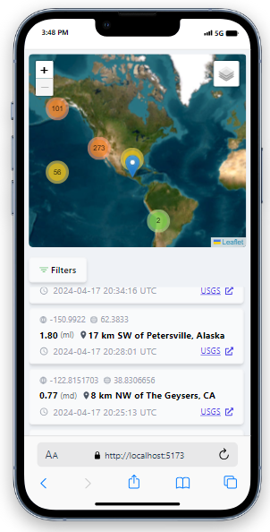
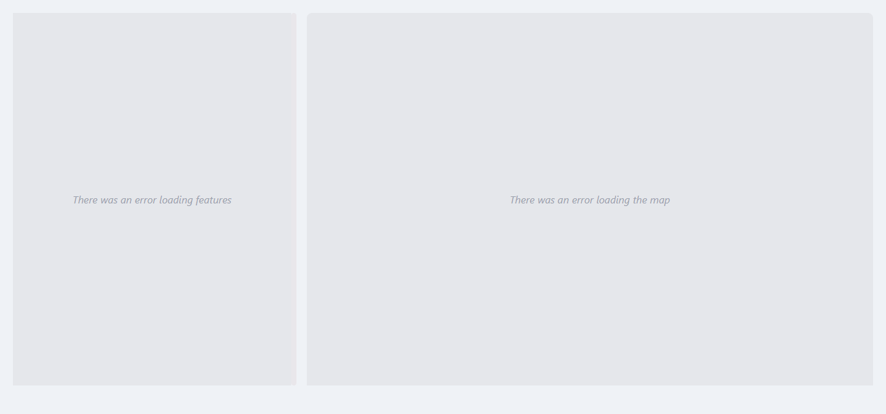

# Earthquakes

Esta es mi solución para el [problema propuesto](requirements.md), para esto he usado el framework Rails debido a que es el más popular para el lenguaje Ruby.

## Contenido

- [Inicializar el proyecto](#inicializar-el-proyecto)
- [Capturas de pantalla](#capturas-de-pantalla)
- [Solución](#solución)
- [Base de datos](#base-de-datos)
- [Task para persistir datos](#task-para-persistir-datos)
- [Validaciones](#validaciones)
- [Endpoints y paginado](#endpoints-y-paginado)
- [Frontend](#frontend)
- [Enlaces externos](#enlaces-externos)

## Inicializar el proyecto

Para inicializar y ejecutar este proyecto fácilmente es necesario usar tener Docker (docker compose) instalado, el proyecto se ejecuta em ambiente de desarrollo por motivo de prueba.

1. Clone el repositorio de GitHub de [Earthquakes](https://github.com/maikcodes/earthquake) y diríjase al directorio [earthquake-api](earthquake-api).

  ```powershell
  git clone https://github.com/maikcodes/earthquake.git
  cd earthquake
  cd earthquake-api
  ```

2. Cree un archivo .env para definir las credenciales necesarias. Este debe estar dentro del directorio earthquake-api. Por simplicidad se añade un ejemplo listo.

  ```powershell
  POSTGRES_DB=earhquakes
  POSTGRES_USER=postgres
  POSTGRES_PASSWORD=postgres

  POSTGIS_HOST=db

  RAILS_ENV=development

  RAILS_MASTER_KEY=4b031eec442d07f254b051244c4dcd90
  ```

3. Ejecutar los servicios con docker compose.
  
  ```powershell
  docker compose up --build
  ```

Con esto se crean e inician los contenedores de la base de datos Postgis, la API RESTful y la aplicación frontend. En el caso de la API, se realiza de manera automática las migraciones y la ejecución de la [Task para persistir datos](#task-para-persistir-datos). Las URLs principales de las aplicaciones son:

- <http://localhost:3000/api/features>
- <http://localhost:3000/api/comments>
- <http://localhost:4000/>

## Capturas de pantalla






 



## Solución

La solución realizada para cumplir con los requerimientos solicitados se describe en las siguentes secciones.

### Base de datos

Postgis es la base de datos usada en este proyecto, la razón es que mejora PostgreSQL para permitirle a esta trabajar con datos geoespaciales usando diferentes tipos de objetos y permitir una mejor escalabilidad en el caso que más datos de este tipo sean empleados y se añadan más características a la aplicación.

### Task para persistir datos

La creación de un __Task__ para consumir y persistir los datos de la API de la USGS de los eventos sismológicos ocurridos en los últimos 30 días (<https://earthquake.usgs.gov/earthquakes/feed/v1.0/summary/all_month.geojson>). Esta task la he diseñado acorde con la práctica de integración de datos ETL (Extracción, Transformación y Carga), [véala aquí](earthquake-api/lib/tasks/etl.rake).

### Validaciones

Las validaciones se han realizado en base al modelo que describe a una [feature](earthquake-api/app/models/feature.rb) y también para el [comentario](earthquake-api/app/models/comment.rb). Las migraciones respectivas también indican la definición de las validaciones para su correcta representación en la base de datos. Además, durante el proceso ETL también se hacen las validaciones respectivas para evitar que se persistan features que no sean válidas.

### Endpoints y paginado

Los endpoints solicitados se han desarrollado de forma correcta y adicionalmente se ha completado los demás métodos HTTP comunes, razón por la cual la aplicación backend es una API RESTful. Si usa la extención de visual studio code [Rest Client](https://marketplace.visualstudio.com/items?itemName=humao.rest-client) puede probar rápidamente los endpoints con las apis de [Features](api-docs/feature.http) y [Comments](api-docs/comment.http)

Para realizar la paginación se emplea la gema __will_paginate__, ya que permite que se realice el paginado de manera fácil y rápida. Esto tanto para las features como para los comentarios. La paginación se realiza de forma automática dando un total de 10 resultados para cada solicitud con los formatos de respuesta solicitados (JSON), si se necesita definir una página exacta o la cantidad de elementos por página se debe hacer uso de los parámetros de paginación, ambos esperan un número entero positivo, puede ser usados independientemente el uno del otro.

- __{page}__: para indicar la página exacta a consultar.
- __{per_page}__: para indicar la cantidad de resultados por página. Si se excede el límite de 1000 solicitado, la cantidad de páginas serán 1000.
- Ejemplos:
  - <http://localhost:3000/api/features?page=1&per_page=100>
  - <http://localhost:3000/api/comments?page=1&per_page=100>
- __Filtros de Features__: En el endpoint correspondiente al método GET de features, se puede hacer uso de un parámetro adicional para filtrar de acuerdo con la magniud del evento, que es __{mag_types}__, los filtros  pueden ser uno o varios (separados por coma) y en caso de no proveer ninguno no se aplicara el filtro.
  - Ejemplos:
    - <http://localhost:3000/api/features?mag_types=md>
    - <http://localhost:3000/api/features?mag_types=md,ml&page=1&per_page=100>
- __Filtros de Comentarios__: En el endpoint correspondiente al método GET de comentarios, se puede hacer uso del filtro de comentarios de acuerdo a un Feature específico, que es __{feature_id}__. Este filtro espera un número entero positivo correspondiente a un id de Feature existente.
  - Ejemplo:
    - <http://localhost:3000/api/comments?feature_id=1&page=1&per_page=100>

- Resumen de los endpoints.
  - Features
    - __GET <http://localhost:3000/api/features>__
    - GET <http://localhost:3000/api/features/{id}>
    - POST <http://localhost:3000/api/features>
    - PUT <http://localhost:3000/api/features/{id}>
    - DELETE <http://localhost:3000/api/features/{id}>
    Para los métodos POST y PUT el cuerpo de la solicitud sigue este formato:

    ```powershell
    {
        "event_type": "Feature",
        "external_id": "us7000masf",
        "magnitude": "4.6",
        "place": "6 km ESE of Salvacion, Philippines",
        "time": "2024-04-08 15:56:24",
        "tsunami": true,
        "mag_type": "mb",
        "title": "M 4.6 - 6 km ESE of Salvacion, Philippines",
        "longitude": 126.2642,
        "latitude": 8.6962,
        "external_url": "https://earthquake.usgs.gov/earthquakes/eventpage/us7000masf"
    }
    ```

  - Comments
    - __GET <http://localhost:3000/api/comments?feature_id={id}>__
    - __GET <http://localhost:3000/api/comments>__
    - GET <http://localhost:3000/api/comments/{id}>
    - POST <http://localhost:3000/api/comments>

     ```powershell
    {
        "comment": {
            "feature_id": 1,
            "body": "This is a test comment."
        }
    }
    ```

    - PUT <http://localhost:3000/api/comments/{id}>

    ```powershell
    {
        "body": "This is a test comment asdasd asd"   
    }
    ```

    - DELETE <http://localhost:3000/api/comments/{id}>

### Frontend

Para la representación de los datos de la API RESTful he decidido usar React, Tailwind CSS y leaflet. Esta última haciendo uso de la api de leaflet, la depenencia dedicada para react react-leaflet y para el uso de clusters con react-leaflet-cluster.

Esta aplicación cuenta con una UI simple y moderna, que permite una fácil interacción con la información de las Features asi como sus comentarios respectivos. Además, la UI de la aplicación es __responsive__.

Esta aplicación será accesible via <http://localhost:4000/>

## Enlaces externos

- <https://www.usgs.gov/programs/earthquake-hazards/earthquakes>
- <https://earthquake.usgs.gov/earthquakes/feed/v1.0/geojson.php>
